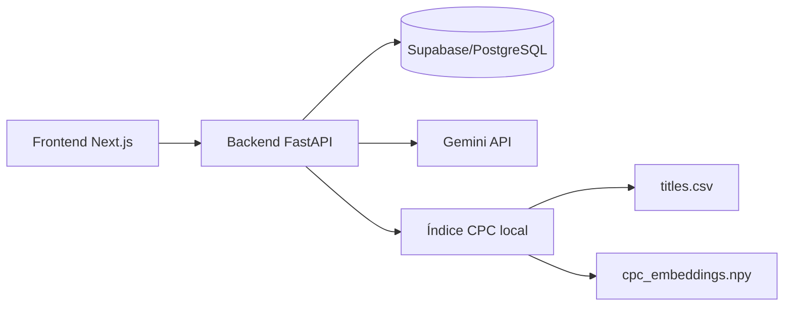

# Patentólogos

Aplicación web para consultar, analizar y clasificar patentes. Combina un catálogo de
patentes almacenado en Supabase, búsqueda híbrida léxica/semántica, asistencia con
Gemini y un recomendador local de códigos CPC basado en embeddings.

> Las clasificaciones y respuestas generadas son ayudas preliminares. Los códigos CPC
> y antecedentes encontrados deben verificarse manualmente antes de tomar decisiones
> legales o de patentabilidad.

## Funcionalidades

- Listado, búsqueda y detalle de patentes almacenadas en Supabase.
- Búsqueda híbrida mediante PostgreSQL FTS, embeddings y Reciprocal Rank Fusion.
- Consulta de patentes similares por distancia coseno.
- Chat contextual sobre las patentes recuperadas, respaldado por Gemini.
- Recomendación de códigos CPC a partir de una descripción técnica.
- Generación de una ecuación lista para consultar en Google Patents.
- Índice CPC local: no requiere Supabase ni una base vectorial externa.

## Arquitectura



| Componente | Tecnología | Función |
| --- | --- | --- |
| Frontend | Next.js 16, React 19, Tailwind CSS 4 | Interfaz de búsqueda, detalle, chat y clasificación CPC |
| Backend | FastAPI, Pydantic | API y coordinación de servicios |
| Patentes | Supabase, PostgreSQL, pgvector | Persistencia, FTS, búsqueda semántica y similitud |
| Embeddings | `paraphrase-multilingual-MiniLM-L12-v2` | Vectores multilingües normalizados de 384 dimensiones |
| Generación | Gemini con cascada de modelos | Chat, selección final de CPC, razones y palabras clave |
| CPC | CSV + NumPy `memmap` | Recuperación vectorial plana de códigos CPC |

### Modelos y respaldo de Gemini

Chat y clasificación usan `backend/app/services/gemini_client.py`. El orden
configurado en `MODEL_CASCADE` es `gemini-3.5-flash-lite`,
`gemini-3.1-flash-lite` y `gemini-2.5-flash-lite`. El cliente pasa al siguiente
modelo al alcanzar el límite local de peticiones o recibir un error 429.
Otros errores de la API se propagan sin intentar el siguiente modelo.

Los límites RPM/RPD son valores configurados en el código, no una consulta de la
cuota disponible en Google. Los contadores viven en memoria por instancia del
cliente; chat y clasificación tienen instancias separadas y tampoco comparten
contadores entre procesos. Revise modelos y límites según el proyecto de Google
utilizado.

Si Gemini falla durante la clasificación, se devuelven hasta cinco candidatos
locales (respetando `top_k`) y una explicación en `notes`. El chat no tiene una
respuesta local de respaldo.

## Estructura del repositorio

```text
Proyecto-patentes/
├── backend/
│   ├── app/
│   │   ├── models/              # Contratos Pydantic
│   │   ├── routes/              # Endpoints FastAPI
│   │   └── services/            # Patentes, embeddings y clasificación CPC
│   ├── data/cpc_index/          # Catálogo e índice CPC local (ignorado por Git)
│   ├── exel/                    # Scripts offline de datos e indexación
│   ├── migrations/              # Migraciones SQL para Supabase
│   ├── tests/                   # Pruebas unitarias y de integración
│   ├── requirements.txt
│   └── requirements-dev.txt
├── frontend/
│   ├── public/
│   ├── src/app/                 # Rutas de Next.js
│   ├── src/components/          # Componentes React
│   └── src/lib/api.ts           # Cliente y tipos de la API
└── README.md
```

## Requisitos

- Git.
- Python 3.11 o superior. El proyecto se ha probado con Python 3.13.7.
- Node.js 20 o superior. El proyecto se ha probado con Node.js 22.19.0.
- npm 10 o superior.
- Un proyecto Supabase con PostgreSQL, `pgvector` y `pg_trgm` disponibles.
- Una API key de Gemini.
- Para el clasificador completo, el dataset CPC `titles.csv` y unos 500 MB libres.
- Conexión a internet la primera vez que Sentence Transformers descargue el modelo.

## Inicio rápido

### 1. Clonar el repositorio

```powershell
git clone https://github.com/jjresher/Proyecto-patentes.git
cd Proyecto-patentes
```

### 2. Instalar el backend

En PowerShell:

```powershell
cd backend
py -m venv .venv
Set-ExecutionPolicy -Scope Process -ExecutionPolicy Bypass
.\.venv\Scripts\Activate.ps1
python -m pip install --upgrade pip
pip install -r requirements-dev.txt
```

`requirements-dev.txt` incluye las dependencias de ejecución y las herramientas de
pruebas. Para una instalación de producción puede usarse solamente:

```powershell
pip install -r requirements.txt
```

En Linux o macOS, la activación equivalente es:

```bash
python3 -m venv .venv
source .venv/bin/activate
python -m pip install --upgrade pip
pip install -r requirements-dev.txt
```

### 3. Configurar el backend

Desde `backend/`, copie la plantilla y complete las credenciales:

```powershell
Copy-Item .env.example .env
```

Configuración de `backend/.env`:

```dotenv
SUPABASE_URL=https://TU_PROYECTO.supabase.co
SUPABASE_KEY=TU_CLAVE_DE_SUPABASE
GEMINI_API_KEY=TU_CLAVE_DE_GEMINI

# Origen exacto del frontend principal.
FRONTEND_ORIGIN=http://localhost:3000

# Permite localhost y redes privadas 10.x, 172.16-31.x y 192.168.x durante desarrollo.
ALLOW_LOCAL_NETWORK_ORIGINS=true
```

Notas:

- El backend actualmente requiere las claves de Supabase y Gemini al iniciar.
- Para scripts de carga administrativa use una clave de Supabase con permisos
  suficientes. No exponga una `service_role` en el frontend ni en Git.
- Los archivos `.env` están ignorados por Git.
- Ejecute los comandos del backend desde `backend/`: la configuración busca
  `.env` en el directorio de trabajo.

### 4. Preparar el índice CPC

Este paso es obligatorio para usar `POST /clasificacion/cpc/recommend`, pero solo se
ejecuta una vez por versión del dataset/modelo.

Desde `backend/`, con el entorno virtual activo:

```powershell
python exel\index_cpc_codes.py `
  --input "C:\ruta\al\dataset\titles.csv" `
  --output data\cpc_index `
  --batch-size 128
```

El CSV debe contener estas columnas:

```text
code,title,section,class,subclass,group,main_group
```

El proceso valida el catálogo, crea textos con contexto jerárquico y genera:

```text
backend/data/cpc_index/
├── titles.csv
├── cpc_embeddings.npy
└── manifest.json
```

Para el catálogo actual de 260.476 códigos, `cpc_embeddings.npy` ocupa alrededor de
400 MB. En CPU puede tardar varias horas; una GPU NVIDIA compatible con PyTorch/CUDA
puede reducir considerablemente ese tiempo. El frontend y el backend pueden permanecer
apagados mientras se construye.

El índice solo debe regenerarse si:

- cambia `titles.csv`;
- cambia el modelo o la dimensión de embeddings;
- cambia el formato interno del indexador;
- se elimina o corrompe alguno de los artefactos.

El directorio está en `.gitignore` porque contiene archivos grandes y reproducibles.
Para compartirlo entre máquinas use Git LFS, almacenamiento de objetos o un artefacto
de release; también puede copiar los tres archivos manualmente.

### 5. Ejecutar el backend

Desde `backend/`:

```powershell
.\.venv\Scripts\Activate.ps1
uvicorn app.main:app --reload --host 0.0.0.0 --port 8000
```

Direcciones útiles:

- API: <http://localhost:8000>
- Swagger/OpenAPI: <http://localhost:8000/docs>
- Esquema OpenAPI: <http://localhost:8000/openapi.json>

### 6. Instalar y ejecutar el frontend

En otra terminal:

```powershell
cd frontend
npm ci
```

Para usar el backend local no se necesita archivo de entorno: el valor por defecto es
`http://localhost:8000`. Para una IP de red o un backend desplegado, cree
`frontend/.env.local`:

```dotenv
NEXT_PUBLIC_API_URL=http://192.168.1.3:8000
```

Inicie Next.js:

```powershell
# Solo en esta máquina
npm run dev

# Accesible desde otros equipos de la red local
npm run dev -- --hostname 0.0.0.0 --port 3000
```

Abra <http://localhost:3000> o `http://IP_DE_LA_MAQUINA:3000`.

La URL de la API debe ser accesible tanto desde el servidor Next.js como desde
el navegador: el listado se consulta en el servidor, mientras que el chat y el
clasificador hacen peticiones desde el navegador. En producción use HTTPS si el
frontend también se sirve por HTTPS.

## Uso de la aplicación

| Ruta del frontend | Uso |
| --- | --- |
| `/` | Catálogo de 20 patentes por página; al buscar, hasta 20 resultados híbridos sin paginación |
| `/patentes/{id}` | Detalle y patentes similares |
| `/clasificar` | Descripción técnica, códigos CPC, ruta jerárquica y ecuación para Google Patents |
| `/acerca` | Información del proyecto |

El chat flotante usa el contexto de la búsqueda o de la patente abierta. El
backend incluye como máximo 20 patentes en el contexto; en la vista de detalle
añade hasta 4000 caracteres de descripción y 3000 de reivindicaciones. El
frontend conserva el contexto de búsqueda en `sessionStorage` de la pestaña.

## Configuración de Supabase

El repositorio asume que ya existe una tabla base llamada `patentes`. Las migraciones
incluidas **no crean esa tabla desde cero**; la amplían con búsqueda, embeddings,
campos nuevos e índices.

La tabla base debe contener, como mínimo, los campos usados por la carga histórica:

```text
id, pn, pc, cpc, ic, ws, ls, ti, ab, descripcion, claimen, espacenet
```

Las migraciones añaden o utilizan, entre otros:

```text
apc, pd, ww, lg_st, embedding, cluster_id, search_vector
```

Ejecute en el SQL Editor de Supabase, en este orden:

1. `backend/migrations/001_enable_extensions_and_columns.sql`
2. `backend/migrations/002_hybrid_search_function.sql`
3. `backend/migrations/003_new_columns_and_unique_pn.sql`

La migración 003 elimina filas con `pn` duplicado y conserva la de mayor `id`
antes de crear la restricción única. Revise los duplicados y respalde los datos
antes de aplicarla a una base existente.

Las migraciones habilitan:

- extensiones `vector` y `pg_trgm`;
- vector de búsqueda FTS ponderado;
- columna `embedding vector(384)`;
- índice HNSW por distancia coseno;
- funciones RPC `search_patentes_hybrid` y `patentes_similares`;
- columnas de los exports actuales y unicidad sobre `pn`.

## Carga opcional de patentes

Los siguientes comandos preparan exports de Patentólogos y los cargan en Supabase.
Todos se ejecutan desde `backend/` con `.env` configurado.

### 1. Convertir y unir archivos Excel

Coloque en `backend/exel/` archivos con estos patrones:

```text
ppulse-export*.xlsx
ppulse-desc*.xlsx
```

Ejecute:

```powershell
python -m exel.convert_xlsx_to_csv
```

Se genera `backend/exel/ppulse-merged.csv`, con normalización, unión por número de
patente, limpieza de HTML, deduplicación y verificación de round trip.

### 2. Subir nuevas patentes

Requiere la migración 003:

```powershell
python -m exel.upload_to_supabase
```

El script ignora números de patente existentes e inserta los nuevos por lotes.

### 3. Generar embeddings de patentes

```powershell
python -m exel.generate_embeddings
```

Solo procesa filas cuyo campo `embedding` sea `NULL`, por lo que es idempotente.

### 4. Calcular clusters

```powershell
python -m exel.cluster_patentes
```

Para cambiar la cantidad de clusters en PowerShell:

```powershell
$env:KMEANS_K="30"
python -m exel.cluster_patentes
```

Este paso requiere que las patentes ya tengan embeddings.

## Endpoints principales

| Método | Ruta | Descripción |
| --- | --- | --- |
| `GET` | `/` | Estado básico del backend |
| `GET` | `/patentes/` | Listado paginado; acepta `page`, `page_size` y `q` |
| `POST` | `/patentes/search/semantic` | Búsqueda híbrida FTS + embeddings |
| `GET` | `/patentes/{id}` | Detalle de una patente |
| `GET` | `/patentes/{id}/similares` | Patentes cercanas por embedding |
| `POST` | `/clasificacion/cpc/recommend` | Recomendación local de CPC y ecuación Google Patents |
| `POST` | `/chat/` | Chat Gemini con contexto de patentes |

Límites de entrada:

| Operación | Parámetros |
| --- | --- |
| Listado | `page >= 1`; `page_size` de 1 a 200 (por defecto 50); `q` opcional, no vacío |
| Búsqueda híbrida | `query` de 1 a 2000 caracteres; `top_k` de 1 a 100 (por defecto 20) |
| Similares | `top_k` de 1 a 50 (por defecto 10) |
| Clasificación CPC | `description` de 1 a 6000 caracteres, no solo espacios; `top_k` de 1 a 20 (por defecto 8) |

El chat recibe `message`, `history` (mensajes con `role` y `content`) y
`patents_context` (objetos de patentes); devuelve `reply`. Los dos últimos campos
son opcionales. Consulte `/docs` para ver los contratos completos.

`GET /` solo confirma que la API responde: no verifica Supabase, Gemini ni el
índice CPC. La clasificación devuelve 503 cuando faltan artefactos del índice o
no son compatibles; los parámetros que incumplen los contratos devuelven 422.

Ejemplo de clasificación CPC:

```powershell
$body = @{
  description = "Sistema electrónico que regula la inyección de combustible según temperatura y velocidad del motor."
  top_k = 8
} | ConvertTo-Json

Invoke-RestMethod `
  -Method Post `
  -Uri "http://localhost:8000/clasificacion/cpc/recommend" `
  -ContentType "application/json" `
  -Body $body
```

Ejemplo de búsqueda semántica:

```powershell
$body = @{ query = "control inteligente de motores"; top_k = 20 } | ConvertTo-Json

Invoke-RestMethod `
  -Method Post `
  -Uri "http://localhost:8000/patentes/search/semantic" `
  -ContentType "application/json" `
  -Body $body
```

## Pruebas y calidad

Backend, desde `backend/`:

```powershell
# Suite completa
python -m pytest

# Salida compacta
python -m pytest -q

# Estilo de Python
python -m ruff check app exel tests
```

Los tests usan clientes falsos; no realizan llamadas reales a Supabase ni Gemini.
La configuración de pruebas proporciona credenciales ficticias, por lo que no
requiere un `.env` real. Estas pruebas no validan las cuotas ni los permisos de
los servicios desplegados.

Frontend, desde `frontend/`:

```powershell
npm run lint
npm run build
```

Para probar el build de producción:

```powershell
npm run build
npm run start
```

## Uso en red local

1. Ejecute FastAPI con `--host 0.0.0.0`.
2. Ejecute Next.js con `--hostname 0.0.0.0`.
3. Configure `NEXT_PUBLIC_API_URL=http://IP_DEL_BACKEND:8000`.
4. Abra `http://IP_DEL_FRONTEND:3000` desde el otro dispositivo.

El backend permite por defecto orígenes HTTP de `localhost`, `127.0.0.1` y rangos
privados `10.x`, `172.16-31.x` y `192.168.x`. En producción configure un
`FRONTEND_ORIGIN` exacto y use:

```dotenv
ALLOW_LOCAL_NETWORK_ORIGINS=false
```

Reinicie los procesos después de cambiar variables de entorno.

## Despliegue

### Backend

- Instale `backend/requirements.txt`.
- Configure todas las variables de `backend/.env` en el proveedor de hosting.
- Proporcione el directorio `backend/data/cpc_index/` como volumen o artefacto si se
  usará la clasificación CPC.
- Ejecute, por ejemplo:

```bash
uvicorn app.main:app --host 0.0.0.0 --port 8000
```

### Frontend

- Configure `NEXT_PUBLIC_API_URL` antes de ejecutar `npm run build`.
- Si cambia esa variable después del build, vuelva a compilar el frontend.
- Ejecute `npm ci`, `npm run build` y `npm run start`.
- Añada el dominio final del frontend a `FRONTEND_ORIGIN` en el backend.

## Solución de problemas

### `Falta el artefacto CPC ... cpc_embeddings.npy`

El índice CPC no se ha generado o no está en `backend/data/cpc_index/`. Ejecute el
comando de la sección **Preparar el índice CPC** y espere a que termine. No inicie el
backend a mitad de la generación.

### `El índice CPC no coincide con titles.csv`

El hash, cantidad de filas, modelo o dimensiones cambiaron. Elimine los artefactos
locales del índice y vuelva a ejecutar `index_cpc_codes.py` usando el CSV correcto.

### Error CORS desde una IP local

- Confirme que el frontend use la IP correcta en `NEXT_PUBLIC_API_URL`.
- Ejecute el backend con `--host 0.0.0.0`.
- Verifique `ALLOW_LOCAL_NETWORK_ORIGINS=true`.
- Reinicie el backend después de modificar `.env`.

### La primera consulta tarda más

Sentence Transformers descarga y carga el modelo la primera vez. Las siguientes
consultas reutilizan el modelo en memoria.

### RPC de Supabase inexistente

Ejecute las migraciones 001, 002 y 003 en orden. Verifique que las funciones
`search_patentes_hybrid` y `patentes_similares` existan en Supabase.

### Gemini devuelve 429 o 502

Revise cuota, facturación y validez de `GEMINI_API_KEY`. El clasificador CPC tiene un
fallback local; el chat puede devolver temporalmente 502 cuando Gemini está ocupado.

### Puerto ocupado

Cambie el puerto y actualice las URLs relacionadas:

```powershell
uvicorn app.main:app --reload --port 8001
npm run dev -- --port 3001
```

### Next.js informa que `.next/lock` está ocupado

Ya hay otro proceso `next dev` o `next build` activo. Detenga ese proceso antes de
iniciar otro build.

## Seguridad y datos locales

- Nunca confirme `.env`, claves de Supabase o claves de Gemini.
- No exponga una clave `service_role` mediante variables `NEXT_PUBLIC_*`.
- `backend/data/cpc_index/` está ignorado porque puede superar 400 MB.
- Los exports de patentes pueden contener información sensible o licenciada; revise
  sus permisos antes de compartirlos.
- La ecuación de Google Patents y los códigos CPC son sugerencias para revisión humana.

## Limitaciones actuales

- El repositorio no crea la tabla base `patentes`; debe existir antes de las migraciones.
- La recuperación CPC es plana y escanea el índice completo para maximizar cobertura.
- El catálogo CPC completo no se distribuye mediante Git.
- La calidad depende del contenido y versión de `titles.csv`.
- Gemini solo puede escoger entre los candidatos recuperados localmente.

## Documentación adicional

- [Frontend: ejecución, rutas y configuración](frontend/README.md).
- [Clasificación CPC: índice, recuperación y contrato](backend/CPC_CLASSIFICATION.md).
- [Auditoría de código](AUDITORIA_CODIGO.md): hallazgos de la revisión;
  contraste su estado con el código actual.
